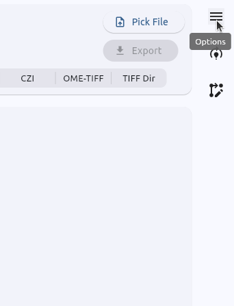
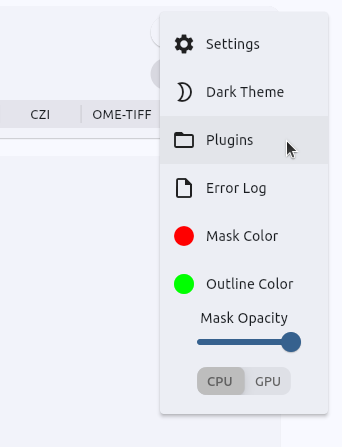
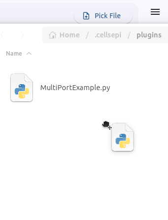

<a href="../../" class="back-card">
  ←
  
    Back to
    Home
  
</a>

Guide · Step 5

<h1>Launch the plugin</h1>

## The `plugins` directory

!!! info
    CellSePi automatically scans the `plugins` directory on startup, finds all classes inheriting from the `Module` base class, and registers them automatically.

CellSePi uses a drop-in plugin system. Your modules are stored in a hidden folder in your user directory: 
`~/.cellsepi/plugins/`.

You don't need to navigate there manually. You can simply open the directory from within the application:

1. Open **Options** in the top-right corner of the application.
   
    

2. Click the **Plugins** button directly in the menu. This opens the folder for you.
    
    

3. Drop your Python file into this folder.

    

---

## Restart CellSePi

Save your file and restart the application. Your module will automatically appear in the show room on the left side of the expert mode.

## Checklist

  

    <h4>✓ Unique name</h4>
    
The <code>_gui_config</code> name is unique across all modules.

  

  

    <h4>✓ super().__init__</h4>
    
Called as the first line of <code>__init__</code>.

  

  

    <h4>✓ Ports declared</h4>
    
All <code>InputPorts</code> and <code>OutputPorts</code> defined in <code>__init__</code>.

  

  

    <h4>✓ run() implementation</h4>
    
Logic implemented. Returning <code>True</code> pauses the pipeline for review.

  

  

    <h4>✓ Outputs assigned</h4>
    
Data assigned to output ports ensures pipeline integrity.

  

  

    <h4>✓ Placed in plugins</h4>
    
The Python file is located in the <code>plugins</code> directory.

  

  <a href="../examples/" class="next-card">
    Next
    Examples →
    
Explore practical examples within the CellSePi ecosystem.
  </a>
  <a href="../quickstart/" class="next-card">
    Or go here
    Quick start →
    Build your first module step by step.
  </a>

