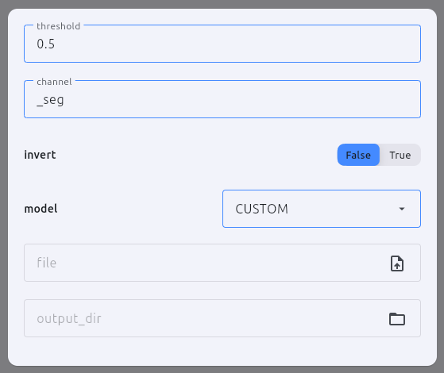
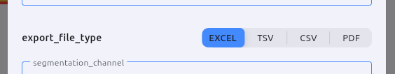
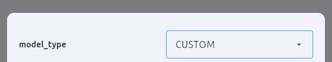
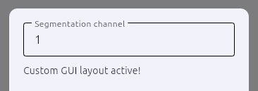

<a href="../../" class="back-card">
  <span class="back-card-icon">←</span>
  <span>
    <span class="back-card-label">Back to</span>
    <span class="back-card-title">Home</span>
  </span>
</a>

<div class="hero-tag">Guide · Step 3</div>
<h1>Define settings</h1>

<p>Any instance attribute prefixed with <code>user_</code> becomes a configurable setting. The GUI overlay is generated automatically, no extra code needed. For advanced use cases, you can also completely override this and build a <a href="#custom-gui">custom GUI</a>.</p>

## Basic example

!!! info
    Always initialize `user_` attributes with a non-empty value. The type of the default determines which GUI control is rendered.

```python
def __init__(self, module_id=None):
    super().__init__(module_id)
    self.user_threshold: float      = 0.5
    self.user_mask_suffix: str      = "_seg"
    self.user_invert: bool          = False
    self.user_model: ModelType      = ModelType.CUSTOM
    self.user_file: FilePath        = FilePath("", suffix=[".tif"])
    self.user_output_dir: DirectoryPath = DirectoryPath("")
```



## Supported types

<div class="custom-card-grid">
  <div class="custom-card static-card">
    <h4><code>str</code></h4>
    <p>Renders a text field.</p>
  </div>
  <div class="custom-card static-card">
    <h4><code>int</code> / <code>float</code></h4>
    <p>Renders a numeric text field. Combine with <code>Limit</code> to enforce a range.</p>
  </div>
  <div class="custom-card static-card">
    <h4><code>bool</code></h4>
    <p>Renders a toggle switch (True / False).</p>
  </div>
  <div class="custom-card static-card">
    <h4><code>Enum</code></h4>
    <p>Renders a segmented button for short enums, or a dropdown for longer ones.</p>
  </div>
  <div class="custom-card static-card">
    <h4><code>FilePath</code></h4>
    <p>Renders a file picker with optional extension filter.</p>
  </div>
  <div class="custom-card static-card">
    <h4><code>DirectoryPath</code></h4>
    <p>Renders a folder picker.</p>
  </div>
</div>

## Limits

!!! warning
    The `limit_` name must exactly match the `user_` name with the prefix swapped. `user_threshold` → `limit_user_threshold`.

Add a matching `limit_` attribute to constrain numeric inputs:

```python
self.user_threshold: float = 0.5
self.limit_user_threshold = Limit(min_val=0.0, max_val=1.0)

self.user_count: int = 5
self.limit_user_count = Limit(min_val=1, max_val=100)
```

## Enums

Define a plain Python `Enum` and use it as the attribute type:

```python
from enum import Enum

class ExportFormat(Enum):
    CSV   = "csv"
    EXCEL = "xlsx"

# In __init__:
self.user_format: ExportFormat = ExportFormat.CSV
```

The GUI automatically decides how to render an `Enum` based on the **total character count** of all its combined option names:

* **Segmented button:** The total character count is **28 or less**. (Ideal for short options like `ALWAYS` / `NEVER`).



* **Dropdown menu:** The total character count **exceeds 28**.


## Change callbacks

For `bool` and `Enum` attributes, an `on_change_` handler is generated automatically. Set it to react to changes:

```python
self.on_change_user_invert = self._on_invert_changed

def _on_invert_changed(self):
    print(f"Invert is now: {self.user_invert}")
```

---

## Dynamic settings (`settings_init`)

Sometimes, auto-generated settings depend on each other (e.g., disabling a threshold input if a specific checkbox is unchecked). 

You can access the generated Flet controls using the `ref_user_` prefix and manipulate them inside the `settings_init` method. This method is called exactly once after the GUI is built but before it is displayed.

```python
def __init__(self, module_id=None):
    super().__init__(module_id)
    self.user_use_threshold: bool = False
    self.user_threshold: float = 355.0
    
    # Link the auto-generated callback
    self.on_change_user_use_threshold = self.update_disable_threshold

def settings_init(self):
    # Set the initial GUI state when the settings overlay is opened
    self.update_disable_threshold()

def update_disable_threshold(self):
    # Access the auto-generated control via self.ref_user_<name>.current
    if self.user_use_threshold:
        self.ref_user_threshold.current.disabled = False
    else:
        self.ref_user_threshold.current.disabled = True
    
    # Force the GUI to visually update
    self._settings.update()
```

## Settings dismissal

If you need to execute code exactly when the user closes the settings overlay (e.g., to validate data, stop a live preview, or clean up temporary resources), assign a callable to `self._on_settings_dismiss`:

```python
def __init__(self, module_id=None):
    super().__init__(module_id)
    self._on_settings_dismiss = self.on_close_settings

def on_close_settings(self):
    print("Settings overlay was closed. Validating current states...")
```

---

<h2 id="custom-gui">Custom GUI</h2>

If the automatic grid layout isn't sufficient for your module (e.g., you need an interactive image canvas, custom galleries, or complex layouts), you can build a completely custom GUI. 

Simply create a valid `flet.Control` (like a `ft.Row`, `ft.Column`, or `ft.Card`) and assign it directly to `self._settings`. For all available GUI components, check out the [official Flet documentation](https://flet.dev/docs/).

```python
import flet as ft

def __init__(self, module_id=None):
    super().__init__(module_id)
    
    # 1. Create your custom Flet components
    self._text_field = ft.TextField(
        value="1",
        label="Segmentation channel",
    )

    # 2. Assign the complete layout to self._settings
    self._settings = ft.Card(
        content=ft.Column([
            self._text_field,
            ft.Text("Custom GUI layout active!")
            ], margin=20
        ),
        expand=False,
        margin=20
    )
```



---

## Persistence

All `user_` attributes are saved when the pipeline is saved and restored when it is loaded. Make sure the default value always represents a valid, usable state.


<div class="custom-card-grid" style="margin-top: 2rem;">
  <a href="../run/" class="next-card">
    <span class="next-card-label">Next</span>
    <span class="next-card-title">Implement run() →</span>
    <span class="next-card-sub">Define the core processing logic where your module executes its primary task.</span>
  </a>
  <a href="../quickstart/" class="next-card">
    <span class="next-card-label">Or go here</span>
    <span class="next-card-title">Quick start →</span>
    <span class="next-card-sub">Build a complete module step by step.</span>
  </a>
</div>